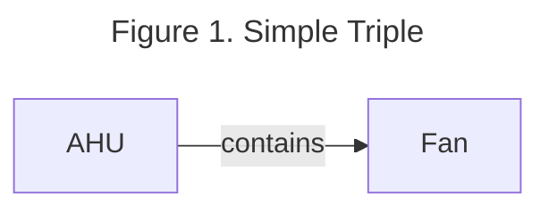
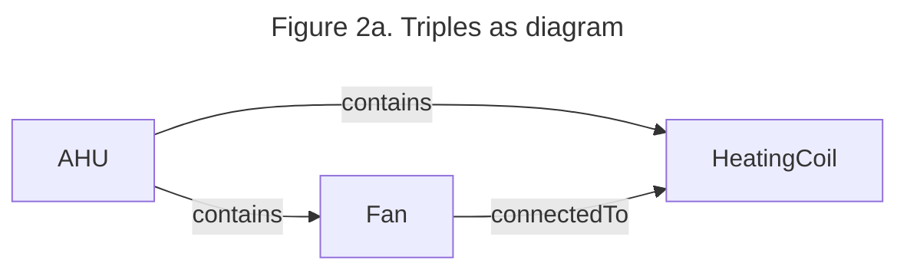

# Basics of RDF 

Standard 223P uses the resource description framework (RDF) to describe metadata for a building using a subject-predicate-object triple model, otherwise known as a directed, labeled graph model. This model allows us to define how different entities related to building systems (devices, data points, zones, ducts, etc) are related to each other. The subject and object define two entities and the predicate defines how they are related. For example, an air handling unit may contain a fan. This would be described in a 223P model as AHU (subject) contains (predicate) Fan (object) as shown in Figure 1. (Brick does a good job of describing RDF for building people, perhaps  we link some documentation)? 



```{mermaid}
graph LR
    AHU-- contains -->Fan
```

There are many figures depicting snippets of 223P models in this user guide. These figures should be read as a series of triples, rather than as a flow chart. Figure 1 shows an example of a 223P model. The direction of the arrow indicates how the subject relates to the object. In the case of Figure 1, the AHU is the subject, and it relates to the Fan using the predicate contains. Triples are generally textualized using the Terse RDF Triple Language (TTL) (cite). Figure 2 shows an example of a series of triples both as a picture and as text in TTL format.  (should maybe make the figure in top braid since many others in this user guide will be in that style) 



<div align="center">
    
<span style="font-size: larger;">Figure 2a. Triples as diagram</span>

</div>

```{mermaid}
graph LR
AHU-- contains -->Fan
AHU-- contains -->HeatingCoil
Fan-- connectedTo -->HeatingCoil
```

<div align="center">
    
<span style="font-size: larger;">Figure 2b. Triples as TTL textual format</span>

</div>

```
@prefix ex: <urn:example/> .
@prefix s223: <http://data.ashrae.org/standard223#> .

    ex:AHU s223:contains ex:Fan .
    ex:AHU s223:contains ex:HeatingCoil .
    ex:Fan s223:connectedTo ex:HeatingCoil .
```