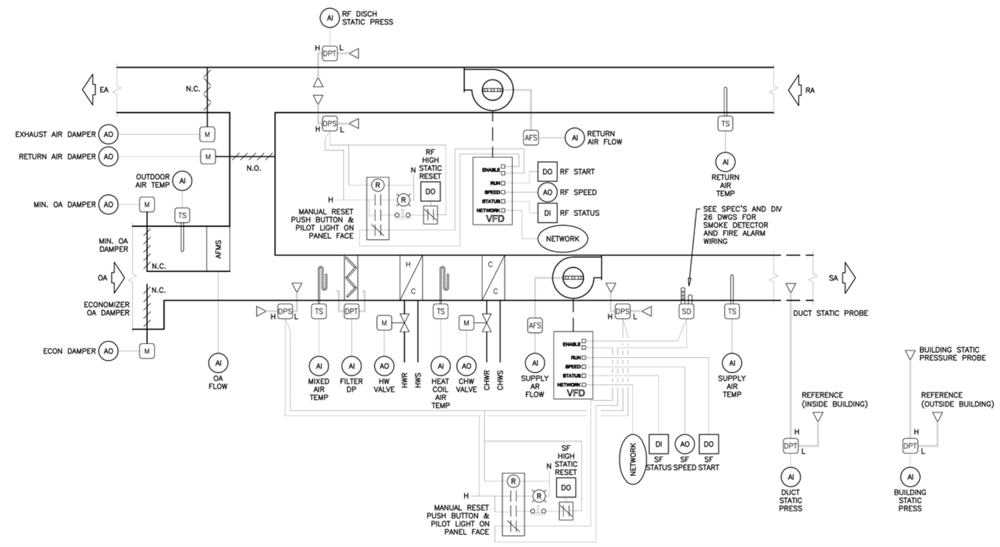

# Guideline 36 Multiple Zone Air Handling Unit

This is an example Multiple Zone Air Handling Unit provided by the American Society of Heating, Refrigerating and Air-Conditioning Engineers (ASHRAE) Guideline 36 document [1], built with the [BuildingMOTIF](https://github.com/NREL/BuildingMOTIF) tool. 

## Downloads

- [Turtle file](../_static/models/g36-extensions-multiple-zone-ahu.ttl)

## Figure

A figure of this piece of equipment is shown in the image below [1]:

## Citations
[1] “Guideline 36-2021 -- High-Performance Sequences of Operation for HVAC Systems.” Guideline 36-2021 -- High-Performance Sequences of Operation for HVAC Systems | ASHRAE Store, www.techstreet.com/ashrae/standards/guideline-36-2021-high-performance-sequences-of-operation-for-hvac-systems?product_id=2229690. 
