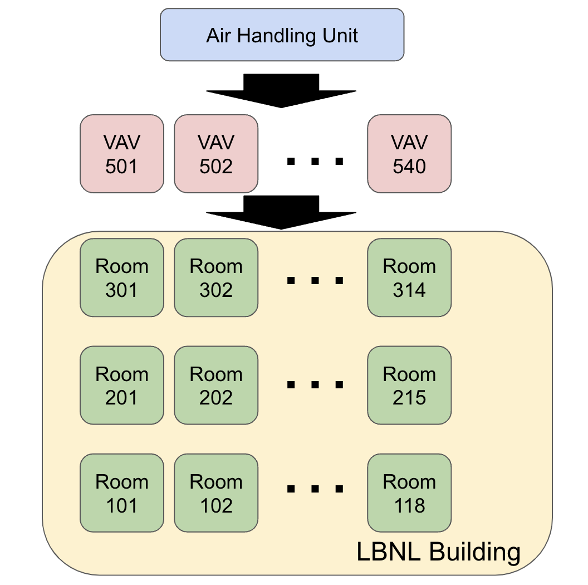

# LBNL Example Building

This is an example building provided by the Lawrence Berkeley National Laboratory, built with the [BuildingMOTIF](https://github.com/NREL/BuildingMOTIF) tool. It has 3 floors, and each floor has some office rooms that are served by Variable Air Volume (VAV) units.  

## Downloads

- [Turtle file](../_static/models/lbnl-example.ttl)

## Figure

A figure of this piece of equipment is shown in the image below [1]:

## Citations
[1] “Guideline 36-2021 -- High-Performance Sequences of Operation for HVAC Systems.” Guideline 36-2021 -- High-Performance Sequences of Operation for HVAC Systems | ASHRAE Store, www.techstreet.com/ashrae/standards/guideline-36-2021-high-performance-sequences-of-operation-for-hvac-systems?product_id=2229690. 
