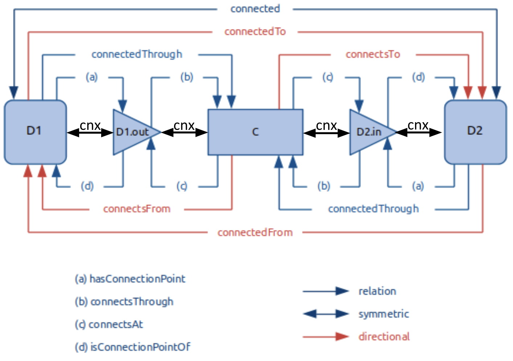

(223-overview)=
# 223 Overview 

This standard allows users to create semantic models that describe the many entities in their buildings that are relevant to the use cases described in (the landing page)[landing-page]. An entity is an abstraction of any physical, logical or virtual item; the actual "things" in a building. Examples are mechanical equipment such as air handling units, luminaires, spatial elements like rooms, the area of these rooms served by certain mechanical equipment, or the zones these rooms may be grouped into based on how the equipment is controlled.

There is a huge amount of information about the many entities within a building that you may want to model. This section will explain what information you should represent in a 223 model and the 223 modeling constructs you will use to do so. Descriptions assume you have some familiarity with RDF graph data and know the [definitions of key terms used in this section](definitions). 

## Using Graph Data Concepts

Standard 223 is represented using the Resource Description Framework (RDF). RDF is a general method for representic semantic information in the form of a triple, which consists of a subject, a predicate, and an object. The subject and object define two entities, which are an instance of some class, and the predicate defines how they are related. A collection of these triples make up a graph. The ASHRAE 223 standard defines classes and relationships relevant to the building space that can then be used to build a multi-graph representing a specific building or group of buildings. For more information about RDF and the other semantic technologies used by the standard, please look at the [reference section](other-resources).

To create a semantic model of your building using Standard 223, you create instances that represent the entities in your building, and define them using the classes and relationships defined or referenced by Standard 223. For example, you may be creating a model of a building in which your air handling unit (ahu-1) contains a fan (fan-1). Your air handling unit (ahu-1) would be modeled as an instance of the 223 class [`s223:AirHandlingUnit`](https://explore.open223.info/s223/AirHandlingUnit.html), which describes the general class of things resembling Air Handling Units. Similarly, your fan (fan-1) would be an instance of the 223 class [`s223:Fan`](https://explore.open223.info/s223/Fan.html). The idea of containment is defined using the 223 relationship [`s223:contains`](https://explore.open223.info/s223/contains.html), so your air handling unit would relate to your fan using the relationship `s223:contains`. The relationship between an instance and a class is defined using the RDF relationship rdf:type, so your ahu and fan would relate to `s223:AirHandlingUnit` and `s223:Fan` using the relation rdf:type. This example is shown in Figure 1. 

    

Figure 1. 223 Modeling Example

## What 223 Models

### Type

This standard provides well defined classes used to describe entities relevant to building system information. Entities in 223 models will generally be instances of the many classes defined or referred to by the standard. The classes in the standard provide 'names' for the fundamental building blocks used in 223 models (e.g. a fan will be an instance of the class [`s223:Fan`](https://explore.open223.info/s223/Fan.html)) and also have rules defining how they are used (e.g. a fan must convey air).

### Topology

This standard can be used to describe the topology of the equipment and spaces in a building, but not the geometric details. Topology refers to the way entities are connected and how some media (e.g. water, air, or electricity) is conveyed between them. There are several different classes used to describe which entities participate in connections and how they cßonnect. This describe [Connectables](https://explore.open223.info/s223/Connectable.html), which include the entities that are capable of connecting to each other; [ConnectionPoints](https://explore.open223.info/s223/ConnectionPoint.html), which model where Connectables can be connected; and [Connections](https://explore.open223.info/s223/Connection.html), which describe physical things through which the medium is conveyed, like pipes or ducts. These [Mediums](https://explore.open223.info/s223/Substance-Medium.html) (e.g. gas, electricity, water) are defined by the standard. There are also multiple relation used to describe the details of these connections, and how the multiple entities involved in a connection relate to each other. Figure 2 summarizes these relations. Though there are many relations to describe different perspectives of a connection, these do not all need to be manually added to the model. If [`s223:cnx`](https://explore.open223.info/s223/cnx.html) is added, the rest can be automatically added to the model through the process of [inference](model-inference). 

    

Figure 2. Relations expressing different perspecties of connection 

(TODO: If there is a good example in Guides, this should link to it)

### Composition

Composition is about what entities make up what other entities. For example, a piece of mechanical equipment like a VAV may in fact be made up of other pieces of mechanical equipment, such as a damper and a reheat coil. Additionally, a zone may be made up of several different spaces that receive a similar building service, or a floor may be made up of different rooms, corridors, or offices. Several different modeling constructs use the idea of containment. These modeling constructs include include [Equipment](https://explore.open223.info/s223/Equipment.html), which may contain other equipment (e.g. VAV containing a Damper); [Zones](https://explore.open223.info/s223/Zone.html), which may contain [DomainSpaces](https://explore.open223.info/s223/DomainSpace.html) that receive a similar building service; [ZoneGroups](https://explore.open223.info/s223/ZoneGroup.html), which group together similarly controlled Zones; [Systems](https://explore.open223.info/s223/System.html) that represent a collection of interrelated Equipment; or [PhysicalSpaces](https://explore.open223.info/s223/PhysicalSpace.html), which may contain other PhysicalSpaces as a floor contains multiple rooms. PhysicalSpaces may also enclose DomainSpaces, indicating that the DomainSpace is completely within the PhysicalSpace. For example, an auditorium may enclose several different areas served by independently controlled lights. 

### Telemetry 

A 223 model does not directly provide telemetric data about the real-time operation or past operation of the building systems. It does provide information about the meaning or context of a given data point and it can link to a source of the data values so that an analytics application can find them. If the building has a BACnet building automation and control system, the model can provide the necessary information for analytic software to learn which BACnet object and property corresponds to the desired piece of information. Data points are defined using Properties. There are multiple types of [Properties](https://explore.open223.info/s223/Property.html), such as control points that can be written to ([ActuatableProperties](https://explore.open223.info/s223/ActuatableProperty.html)), sensor points that are observed ([ObservableProperties](https://explore.open223.info/s223/ObservableProperty.html)), either of which can refer to enumerated ([EnumerableProperty](https://explore.open223.info/s223/EnumerableProperty.html)) or quantified ([QuantifiableProperty](https://explore.open223.info/s223/QuantifiableProperty.html)) values. Properties may also be used for mathematical operations, including those common in a building such as control logic. This idea is defined using [FunctionBlocks](https://explore.open223.info/s223/FunctionBlock.html). Properties also have many different characteristics which are described by a vocabulary of [EnumerationKinds](https://explore.open223.info/s223/EnumerationKind.html). 

### Characteristics

A model can also describe the characteristics of the entities in a building. These characteristics express details about entities that are not otherwise expressed by the class. Often, these characteristics are linked to specific instances in a model. For example, a characteristic of a pump would be its rated flow. Another pump in the same model may have a different rated flow, but it will use the same 223 class (i.e. [`s223:Pump`](https://explore.open223.info/s223/Pump.html)). These types of characteristics are modeled using [Properties](https://explore.open223.info/s223/Property.html). 

Properties also have various characteristics, including their units, quantity kinds, enumeration kinds, and aspects. [Units](https://www.qudt.org/doc/DOC_VOCAB-UNITS.html) describe the unit (e.g. Fahrenheit) of a [QuantifiableProperty](https://explore.open223.info/s223/QuantifiableProperty.html) and [quantity kinds](https://www.qudt.org/doc/DOC_VOCAB-QUANTITY-KINDS.html) describe the type of quantity that may be stated by means of units (e.g. temperature). These are modeled using [qudt ontologies](https://qudt.org/). [EnumerableProperties](https://explore.open223.info/s223/EnumerableProperty.html) do not have units, but they have enumerated values that can be described by [EnumerationKinds](https://explore.open223.info/s223/EnumerationKind.html). Aspects establish the context of a Property. For example, if a Property has a Temperature value of 45.3, the hasAspect relation is used to state what that represents, such as a Temperature limit during working hours, etc. A Property can have any number of hasAspect relations, as needed to establish the context. Aspects are also defined using [EnumerationKinds](https://explore.open223.info/s223/EnumerationKind.html).