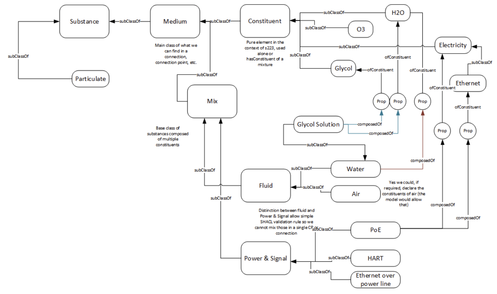

# Medium Mixtures

The 223 standard includes a large set of enumerations, defined as a hierarchy of subclasses under the class `s223:EnumerationKind`.
One important piece of this hierarchy is the class `s223:EnumerationKind-Substance` and its direct subclass `s223:Substance-Medium`. 
It is this branch of the hierarchy where you can find what you would expect to be flowing in a building, such as water, air and electricity. It is important to understand how a medium is modeled, especially when that medium is a mixture. The diagram below sketches the structure of the hierarchy. The names of the classes are abbreviated for clarity, so `s223:Substance-Medium` is shown as Medium for example. In the standard, each of the names follows the hyphenated naming convention of \<parent class>-\<local class>.

Note in the figure that there is a division of the Medium class into Mix and Constituent. The Mix class is further divided into Fluid and Power&Signal. Fluid means what you might think - a liquid or gas that typically flows inside some sort of conduit like a duct or a pipe. You can find Water and Air here. To capture the description of what is in a mixture, the model contains the class Constituent and its subclasses. These subclasses are intended to identify the constituents of a mixture. So, for example, a water-glycol mixture would be defined as `s223:Water-GlycolSolution`, with two Properties via the relation `s223:composedOf`. Each of these Properties has a relation `s223:ofConstituent` that identifies one of the constituents from the Medium-Constituent hierarchy. Each Property also captures any other defining information. This is illustrated in the following figure for a 30%  Water-Glycol mixture.

Mixtures (`s223:Medium-Mix`) and constituents (`s223:Medium-Constituent`) are modeled this way to allow for compatibility validation among ConnectionPoints and Connections. Two mediums are deemed compatible if they share at least one common constituent. 