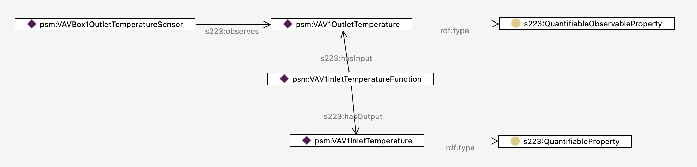

# Sensors and Properties

The 223 standard defines a variety of specialized sensors defined as a hierarchy of subclasses under the class `s223:Sensor`. This explanation section discusses some common relationships among sensors, and between sensors and properties.

## Sensors versus Sensor Platforms
The standard constrains an instance of a Sensor to observe a single `s223:ObservableProperty`. Usually it is an instance of the subclass `s223:QuantifiableObservableProperty` that has a numerical value, but some sensors do generate non-numerical values such as alarms or presence, in which case the property is an instance of `s223:EnumeratedObservableProperty`. 

Equipment that observes multiple kinds of properties, say temperature and humidity, is modeled as an instance of `s223:Equipment` that contains (`s223:contains`) an instance of `s223:TemperatureSensor` and `s223:HumiditySensor` respectively. Note that if any of the sensors have `s223:ConnectionPoint`s, the pattern described [here](https://docs.open223.info/guides/design-patterns.html#containment) must also be followed. This might be the case for a flow sensor, for example.

## Derived Properties
Another constraint in the 223 standard is that an `s223:ObservableProperty` must be associated with a `s223:Sensor` that observes a phenomenon and generates the value of the property. The sensor `s223:observes` the property. 

How does one model a property that is not directly observed by a sensor? This is best modeled using a `s223:Function` that has one or more input properties (`s223:hasInput`) and one or more output properties (`s223:hasOutput`). The input properties may be directly observed by sensors, or may themselves be the outputs of other functions. The output property would be modeled as an instance of `s223:QuantifiableProperty` or `s223:EnumerableProperty` as appropriate, but it is not a `s223:ObservableProperty`.

In this way, a model may contain the computed temperature of a room based on some distant sensors and air flow rates for example.

An example is the `psm:VAV1OutletTemperature` property from the example model found [here](https://models.open223.info/examples/nist-bdg1-1.html).

