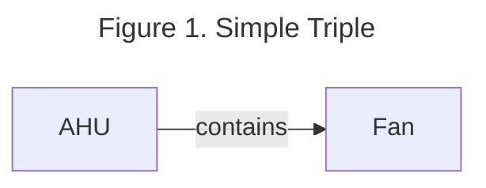
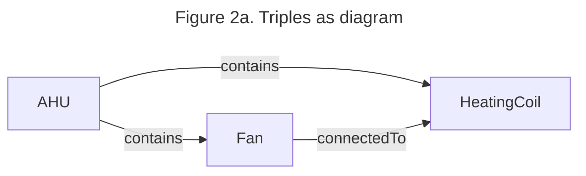

# Semantic Web Technologies

This section provides basic descriptions of a few of the essential semantic web technologies leveraged by 223P. 

## Basics of RDF 

Standard 223P uses the resource description framework (RDF) to describe metadata for a building using a subject-predicate-object triple model, otherwise known as a directed, labeled graph model. This model allows us to define how different entities related to building systems (devices, data points, zones, ducts, etc) are related to each other. The subject and object define two entities and the predicate defines how they are related. For example, an air handling unit may contain a fan. This would be described in a 223P model as AHU (subject) contains (predicate) Fan (object) as shown in Figure 1. (Brick does a good job of describing RDF for building people, perhaps  we link some documentation)? 



```{mermaid}
graph LR
    AHU-- contains -->Fan
```

There are many figures depicting snippets of 223P models in this user guide. These figures should be read as a series of triples, rather than as a flow chart. Figure 1 shows an example of a 223P model. The direction of the arrow indicates how the subject relates to the object. In the case of Figure 1, the AHU is the subject, and it relates to the Fan using the predicate contains. Triples are generally textualized using the Terse RDF Triple Language (TTL) (cite). Figure 2 shows an example of a series of triples both as a picture and as text in TTL format.  (should maybe make the figure in top braid since many others in this user guide will be in that style) 



<div align="center">
    
<span style="font-size: larger;">Figure 2a. Triples as diagram</span>

</div>

```{mermaid}
graph LR
AHU-- contains -->Fan
AHU-- contains -->HeatingCoil
Fan-- connectedTo -->HeatingCoil
```

<div align="center">
    
<span style="font-size: larger;">Figure 2b. Triples as TTL textual format</span>

</div>

```
@prefix ex: <urn:example/> .
@prefix s223: <http://data.ashrae.org/standard223#> .

    ex:AHU s223:contains ex:Fan .
    ex:AHU s223:contains ex:HeatingCoil .
    ex:Fan s223:connectedTo ex:HeatingCoil .
```


## Basics of SHACL

ASHRAE Standard 223P utilizes SHACL for validation and inference. Both validation and inference play a role in creating complete and correct models. Validation ensures that information within the model conforms to rules in the standard, while inference adds information to the graph when a rule’s conditions are met. 

### SHACL Validation Rules

_Technical Description:_ These rules are constraints defined in a SHACL shape that are applied to RDF data to ensure it adheres to specific structural and semantic requirements. They are essentially conditions the data must satisfy to be valid according to the defined shape.

_Process:_ Validation rules involve checking properties, types, value ranges, patterns, and other aspects of data nodes against specified criteria in the SHACL shapes. If a node in the RDF graph violates any of these constraints, it is flagged as non-compliant.

_Example:_ Suppose you have a SHACL shape that defines a Person class. The validation rules might specify that each Person must have a name (of datatype string) and an age (of datatype integer and greater than 0). The validation process will check each instance of Person in your RDF data against these rules and identify any instances that don't conform.

Further, Standard 223 uses SHACL inference rules (both TripleRules and SPARQLRules, part of SHACL Advanced Features)(ref. https://w3c.github.io/shacl/shacl-af/).

### SHACL Inference Rules

_Technical Description:_ SHACL inference rules are used to derive or infer new RDF triples based on existing data that is logically implied but not explicitly stated.

_Process:_ Inference rules typically use conditions to match certain patterns in the data, and new triples are created when these conditions are met. These rules can add valuable information to a dataset, make implicit relationships explicit, and enhance data interconnectivity.

_Example:_ Consider a dataset describing books and authors. You might have a rule stating, "If a person has written a book, they can be inferred to have the role of an author." In SHACL, this could be a rule that, upon finding a triple like [:hasWritten :someBook], automatically adds a new triple [:hasRole :Author]. Thus, if John has written "Book A" (expressed as [:John :hasWritten :BookA]), the rule would infer and add [:John :hasRole :Author].
One important example of SHACL inferencing is in deriving the family of relations between Equipment, ConnectionPoints, and Connections from the base s223:cnx relation (see section on Connections in the standard). It is worth noting that in the S223 standard, SHACL inference rules are used only to add new relations between existing entities and not to define new entities. This avoids the complex issue of ensuring unique identifiers (URIs) for new entities. 
Models can be validated using BuildingMOTIF and TopBraid Composer. The SHACL reasoners that power these tools, PySHACL and the TopBraid reasoner, are also available for use independently of the platforms.


## Querying Models

SPARQL (SPARQL Protocol and RDF Query Language) querying is a fundamental aspect of interacting with RDF-based semantic models. SPARQL provides a powerful and expressive language for querying RDF data, enabling users to retrieve specific information from semantic graphs, insert data into graphs, or construct new graphs based on query results. With SPARQL, users can construct queries to search, filter, and extract data based on the defined relationships and properties within the RDF model. These queries can range from simple requests for specific data points to complex inquiries involving multiple patterns and conditions. It plays a key role in extracting meaningful data from 223P models. Several tools support the use of SPARQL queries to interrogate 223P models. RDFLib supports querying and is used both by BuildingMOTIF and Bob. TopBraid Composer and GraphDB both support SPARQL queries, and provide a graphical user interface for exploring semantic models. 

SPARQL querying basics: The SPARQL querying language is used in SHACL graphs. While SHACL graphs use multiple subject-predicate-object expressions to describe complex relationships. SPARQL is used to query specific information from those complex relationships of SHACL graphs. For example, SPARQL can retrieve SHACL subject-predicate-object expressions with a specific subject, a specific predicate, a specific object, or any combinations of subject, predicate, and object. 

In the model usage section ___ below, a tutorial shows how to run SPARQL competency questions on 223P models. Open223 provides these example models and queries, and also allows users to upload their own building models and write their own SPARQL queries for further testing.

Several other query languages are often used for graph data models. These include the Cypher language employed by Neo4J and GraphQL. Unlike SPARQL, which is designed specifically for RDF, they can still be used on 223P models. 

In example ___ below, a tutorial 

