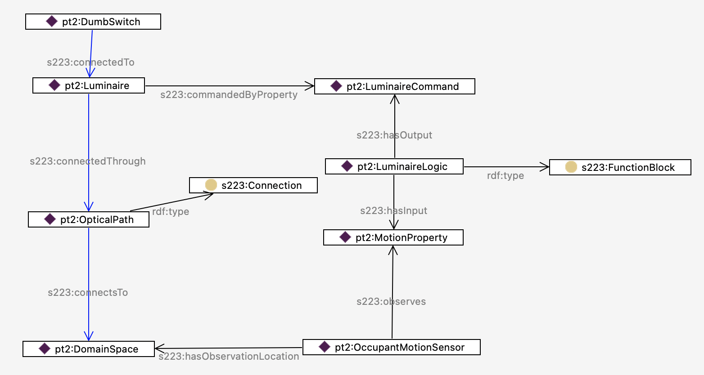

# Modeling Design Patterns

TODO Section on design patterns here
This could also be reference, if we just want to treat them as examples of how 223P models are constructed

Several modeling tools such as BuildingMOTIF and Bob enable modelers to easily reuse design patterns in their models. Both of these tools have pre-existing templates that allow developers to model at a higher level. However, buildings are unique and developers may need to model pieces of equipment that are not already represented in 223P model creation tools. This section shows developers how to model several pieces of equipment. These can be used as a how-to-guide for modeling the piece of equipment in question, or as an example of how 223P models are designed that can be applied to new models.

