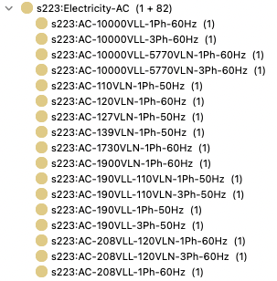
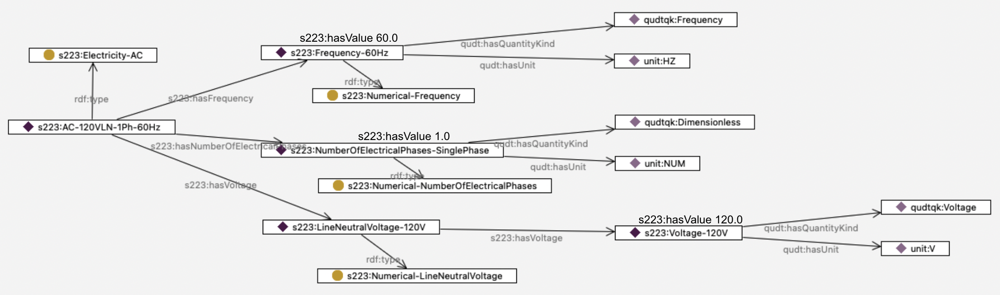
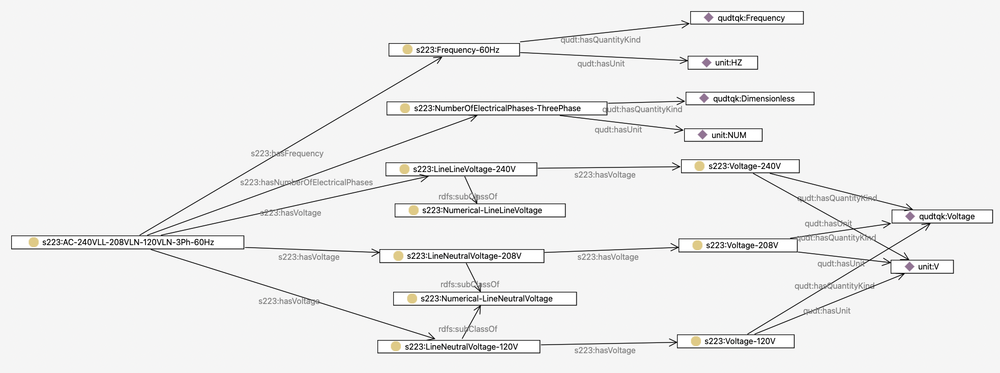

# Modeling Electricity

Specifying the electrical service on a wire or circuit warrants a bit of explanation. This guide shows the simple way to specify the electrical characteristics, 
and then goes into more detail about what is "under the hood" interms of modeling it.

## Using predefined electrical service
The 223 standard comes with a predefined vocabulary of common electrical service, so the easiest way to model is simply to pick the appropriate service from the controlled vocabulary. 
Shown below is a small excerpt of available AC electrical service.

There is a naming convention to help the human reader in understanding each option, but note that later in this guide we will show how all the 
properties of the service are queryable without resorting to parsing the name of the service. With that disclaimer, 
a human reader can interpret the service s223:AC-120VLN-1Ph-60Hz to mean "AC electricity, carrying 120 volts between Line and Neutral, single-phase, at 60Hz frequency".

A more complex example is s223:AC-240VLL-208VLN-120VLN-3Ph-60Hz, meaning "three-phase, 60Hz AC electricity, with a 240V line-line voltage, a 208V line-neutral voltage and also a 127V line-neutral voltage".

Assuming your desired electrical service is listed in the vocabulary, the simplest way to model the electricity in the building is to use the s223:hasMedium relation, as shown below:

## The structure of the electricity vocabulary entries
Since 223 is a semantic standard, relying on the naming convention is not sufficient to allow for querying of a model. 
For those who need to go deeper, the following section explains the structure of each of the vocabulary entries for electricity. Shown below is a diagram of that structure:

Following the relations, you can see that it is possible to find the numerical values for the frequency, number of phases, and voltage for the service. 
Note that the semantic model never depends on the names of the entities to provide this information, so that numerical comparisons and calculations are possible.

Here is that more complex example shown with its full structure:

