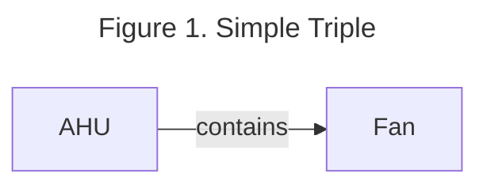
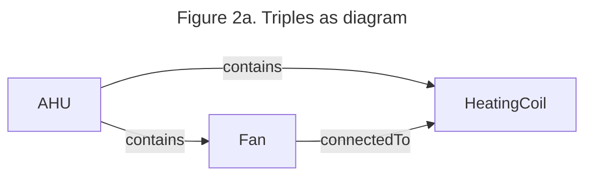

# Open223 Documentation [](https://open223.github.io/docs.open223.info/)

ASHRAE standard 223P is a proposed standard that formally defines knowledge concepts for representing building system information such as the connections between (pieces of) mechanical equipment, spaces within a building, and their measurement and control points. It is a metadata schema (semantic ontology?) that defines the modeling constructs and rules needed to construct semantically interoperable, machine-readable semantic models that provide software applications the ability to determine essential information about the meaning and context of building data to support the deployment of various advanced features such as advanced building controls, fault detection and diagnostics, and automated commissioning. 

Standard 223P uses the resource description framework (RDF) to describe metadata for a building using a subject-predicate-object triple model, otherwise known as a directed, labeled graph model. This model allows us to define how different entities related to building systems (devices, data points, zones, ducts, etc) are related to each other. The subject and object define two entities and the predicate defines how they are related. For example, an air handling unit may contain a fan. This would be described in a 223P model as AHU (subject) contains (predicate) Fan (object) as shown in Figure 1. (Brick does a good job of describing RDF for building people, perhaps  we link some documentation)? 



There are many figures depicting snippets of 223P models in this user guide. These figures should be read as a series of triples, rather than as a flow chart. Figure 1 shows an example of a 223P model. The direction of the arrow indicates how the subject relates to the object. In the case of Figure 1, the AHU is the subject, and it relates to the Fan using the predicate contains. Triples are generally textualized using the Terse RDF Triple Language (TTL) (cite). Figure 2 shows an example of a series of triples both as a picture and as text in TTL format.  (should maybe make the figure in top braid since many others in this user guide will be in that style) 



<div align="center">
    
<span style="font-size: larger;">Figure 2b. Triples as TTL textual format (bottom)</span>

</div>

```
@prefix ex: <urn:example/> .
@prefix s223: <http://data.ashrae.org/standard223#> .

    ex:AHU s223:contains ex:Fan .
    ex:AHU s223:contains ex:HeatingCoil .
    ex:Fan s223:connectedTo ex:HeatingCoil .
```

For more information about the standard itself, check the 223p publication document (will this be available?) and website (link). 
Maybe mention external references/bacnet, though that has a section later
Beyond just the RDF representation, Standard 223 uses the SHACL (Shapes Constraint Language) (ref. https://www.w3.org/TR/shacl/) to specify the conformance requirements for using the defined classes and predicates in allowed ways. These requirements are specified using SHACL validation rules.


## Table of Contents
```{tableofcontents}
```
