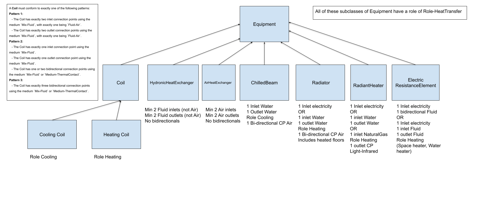
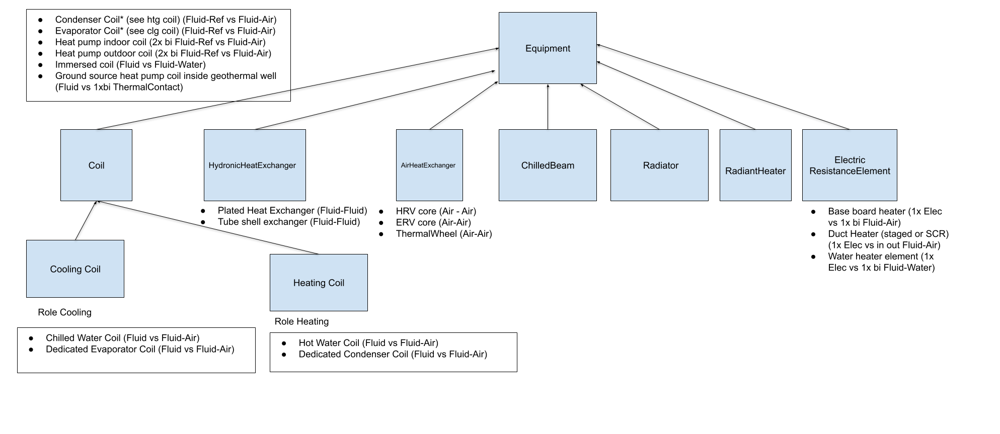
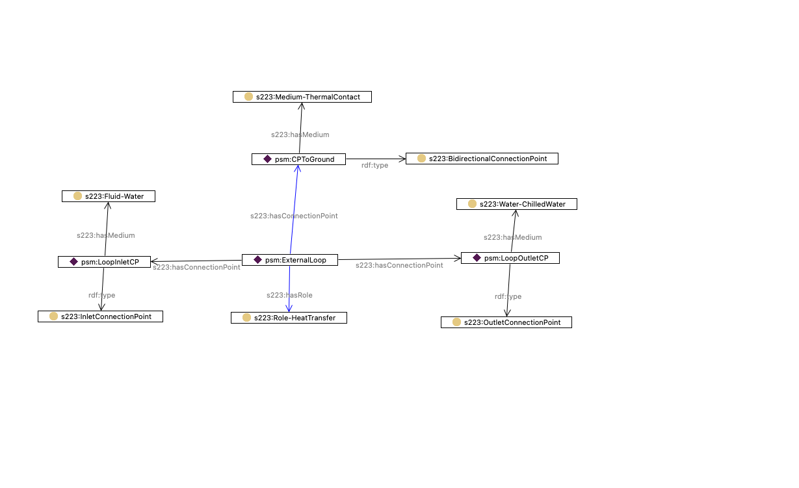

# Modeling Heat Transfer Equipment

A variety of Equipment subclasses are defined in the 223 standard. The names of the classes are 
intended to align with common names in the field as much as possible, but the technical distinctions 
among them are defined in terms of the constraints they must satisfy. These constraints primarily 
concern the patterns of allowed ConnectionPoints, both in terms of the Medium flowing and in terms of 
the directionality and number of ConnectionPoints. A diagram summarizing all Equipment subclasses that 
are involved in the transfer of heat is shown below. Note that instances of all of the classes shown 
will have a role of Role-HeatTransfer in addition to other possible roles. Role-HeatTransfer is added 
automatically using an inference rule.

While the constraints indicated in the figure are the defining characteristics of each of the classes, 
it is easier to see how they are used by consulting the second figure that shows examples of 
equipment commonly found in the field.

The figure below shows a ground loop from [NIST Example Building 1 Model 1](https://models.open223.info/examples/nist-bdg1-1.html#). The ground loop is modeled as 
a Coil matching Pattern 2 of the constraints listed in the first figure above. 

